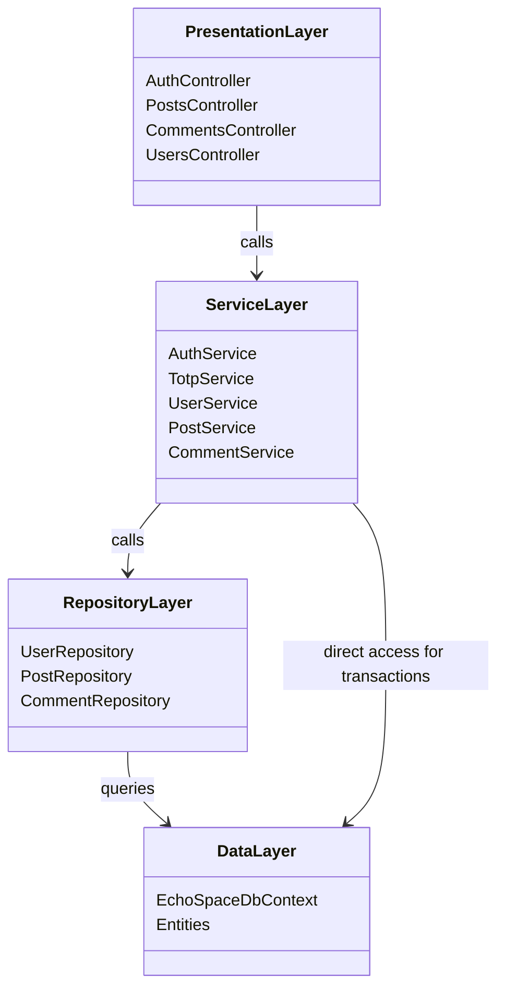

# EchoSpace Class Diagram

## Mermaid Class Diagram Script

```mermaid
classDiagram
    %% Core Entities
    class User {
        +Guid Id
        +string Name
        +string Email
        +string UserName
        +string PasswordHash
        +UserRole Role
        +bool EmailConfirmed
        +bool LockoutEnabled
        +DateTimeOffset LockoutEnd
        +int AccessFailedCount
        +DateTime LastLoginAt
        +DateTime CreatedAt
        +DateTime UpdatedAt
        +string TotpSecretKey
        +bool EmailVerified
        +string EmailVerificationCode
        +DateTime EmailVerificationCodeExpiry
        +int EmailVerificationAttempts
        +ICollection~UserSession~ UserSessions
        +ICollection~AuthProvider~ AuthProviders
        +ICollection~Post~ Posts
        +ICollection~Comment~ Comments
        +ICollection~Like~ Likes
        +ICollection~Follow~ Followers
        +ICollection~Follow~ Following
    }

    class UserSession {
        +Guid SessionId
        +Guid UserId
        +string RefreshToken
        +string DeviceInfo
        +string IpAddress
        +DateTime ExpiresAt
        +DateTime CreatedAt
        +User User
    }

    class AuthProvider {
        +Guid AuthId
        +Guid UserId
        +string Provider
        +string ProviderUid
        +string AccessToken
        +DateTime CreatedAt
        +User User
    }

    class PasswordResetToken {
        +Guid Id
        +Guid UserId
        +string Token
        +DateTime ExpiresAt
        +DateTime CreatedAt
        +bool IsUsed
        +DateTime UsedAt
        +User User
    }

    class Post {
        +Guid PostId
        +Guid UserId
        +string Content
        +string ImageUrl
        +DateTime CreatedAt
        +DateTime UpdatedAt
        +User User
        +ICollection~Comment~ Comments
        +ICollection~Like~ Likes
    }

    class Comment {
        +Guid CommentId
        +Guid PostId
        +Guid UserId
        +string Content
        +DateTime CreatedAt
        +Post Post
        +User User
    }

    class Like {
        +Guid LikeId
        +Guid PostId
        +Guid UserId
        +DateTime CreatedAt
        +Post Post
        +User User
    }

    class Follow {
        +Guid FollowerId
        +Guid FollowedId
        +DateTime CreatedAt
        +User Follower
        +User Followed
    }

    %% DTOs
    class RegisterRequest {
        +string Name
        +string Email
        +string Password
    }

    class LoginRequest {
        +string Email
        +string Password
    }

    class AuthResponse {
        +string AccessToken
        +string RefreshToken
        +int ExpiresIn
        +bool RequiresTotp
        +UserDto User
    }

    class UserDto {
        +Guid Id
        +string Name
        +string Email
        +string UserName
        +string Role
    }

    %% Services
    class IAuthService {
        <<interface>>
        +Task~AuthResponse~ RegisterAsync(RegisterRequest)
        +Task~AuthResponse~ LoginAsync(LoginRequest)
        +Task~AuthResponse~ RefreshTokenAsync(string)
        +Task LogoutAsync(string)
        +Task~AuthResponse~ GoogleLoginAsync(string, string, string)
        +Task~ForgotPasswordResponse~ ForgotPasswordAsync(ForgotPasswordRequest)
        +Task~ValidateResetTokenResponse~ ValidateResetTokenAsync(ValidateResetTokenRequest)
        +Task~bool~ ResetPasswordAsync(ResetPasswordRequest)
        +Task~AuthResponse~ VerifyTotpAndLoginAsync(string, string)
    }

    class AuthService {
        -EchoSpaceDbContext context
        -IConfiguration configuration
        -ILogger logger
        -IEmailSender emailSender
        -ITotpService totpService
        +RegisterAsync(RegisterRequest) AuthResponse
        +LoginAsync(LoginRequest) AuthResponse
        +RefreshTokenAsync(string) AuthResponse
        +LogoutAsync(string)
        +GoogleLoginAsync(string, string, string) AuthResponse
        +ForgotPasswordAsync(ForgotPasswordRequest) ForgotPasswordResponse
        +ValidateResetTokenAsync(ValidateResetTokenRequest) ValidateResetTokenResponse
        +ResetPasswordAsync(ResetPasswordRequest) bool
        +VerifyTotpAndLoginAsync(string, string) AuthResponse
        -GenerateTokensAsync(User) AuthResponse
        -GenerateAccessToken(User) string
        -GenerateRefreshToken() string
        -HashPassword(string) string
        -VerifyPassword(string, string) bool
        -GenerateSecureToken() string
    }

    class ITotpService {
        <<interface>>
        +Task~TotpSetupResponse~ SetupTotpAsync(string)
        +Task~bool~ VerifyTotpAsync(string, string)
        +Task~bool~ SendEmailVerificationCodeAsync(string)
        +Task~bool~ VerifyEmailCodeAsync(string, string)
        +Task~string~ GenerateQrCodeAsync(string, string)
    }

    class TotpService {
        -EchoSpaceDbContext context
        -IConfiguration configuration
        -ILogger logger
        -IEmailSender emailSender
        +SetupTotpAsync(string) TotpSetupResponse
        +VerifyTotpAsync(string, string) bool
        +SendEmailVerificationCodeAsync(string) bool
        +VerifyEmailCodeAsync(string, string) bool
        +GenerateQrCodeAsync(string, string) string
        -GenerateSecretKey() byte[]
        -ToBase32(byte[]) string
        -FromBase32(string) byte[]
        -GetCurrentTimeStep() long
        -GenerateTotpCode(byte[], long) string
    }

    class IEmailSender {
        <<interface>>
        +Task SendEmailAsync(string, string, string)
    }

    class EmailSender {
        -EmailSettings settings
        +SendEmailAsync(string, string, string)
    }

    %% Controllers
    class AuthController {
        -IAuthService authService
        -ITotpService totpService
        -ILogger logger
        -IHttpClientFactory httpClientFactory
        -IEmailSender emailSender
        -EchoSpaceDbContext context
        +POST Register(RegisterRequest)
        +POST Login(LoginRequest)
        +POST RefreshToken(RefreshTokenRequest)
        +POST Logout(LogoutRequest)
        +GET GoogleLogin()
        +GET GoogleCallback(string, string)
        +POST ForgotPassword(ForgotPasswordRequest)
        +POST ValidateResetToken(ValidateResetTokenRequest)
        +POST ResetPassword(ResetPasswordRequest)
        +POST SetupTotp(TotpSetupRequest)
        +POST VerifyTotp(TotpVerificationRequest)
        +POST SendEmailVerification(TotpSetupRequest)
        +POST VerifyEmail(EmailVerificationRequest)
    }

    %% Repositories
    class IUserRepository {
        <<interface>>
        +Task~User~ GetByIdAsync(Guid)
        +Task~User~ GetByEmailAsync(string)
        +Task~IEnumerable~User~~ GetAllAsync()
        +Task~User~ CreateAsync(User)
        +Task~User~ UpdateAsync(User)
        +Task DeleteAsync(Guid)
    }

    class UserRepository {
        -EchoSpaceDbContext context
        +GetByIdAsync(Guid) User
        +GetByEmailAsync(string) User
        +GetAllAsync() IEnumerable~User~
        +CreateAsync(User) User
        +UpdateAsync(User) User
        +DeleteAsync(Guid)
    }

    %% Context
    class EchoSpaceDbContext {
        +DbSet~User~ Users
        +DbSet~UserSession~ UserSessions
        +DbSet~AuthProvider~ AuthProviders
        +DbSet~PasswordResetToken~ PasswordResetTokens
        +DbSet~Post~ Posts
        +DbSet~Comment~ Comments
        +DbSet~Like~ Likes
        +DbSet~Follow~ Follows
    }

    %% Relationships - Entities
    User "1" --> "*" UserSession : has
    User "1" --> "*" AuthProvider : has
    User "1" --> "*" PasswordResetToken : has
    User "1" --> "*" Post : creates
    User "1" --> "*" Comment : writes
    User "1" --> "*" Like : gives
    User "1" --> "*" Follow : followers
    User "1" --> "*" Follow : following
    Post "1" --> "*" Comment : has
    Post "1" --> "*" Like : receives
    Comment --> User : authored by
    Like --> User : given by
    Like --> Post : on
    Follow --> User : follower
    Follow --> User : followed

    %% DTO Relationships
    RegisterRequest --> AuthResponse : returns
    LoginRequest --> AuthResponse : returns
    AuthResponse --> UserDto : contains

    %% Service Layer
    AuthController --> IAuthService : uses
    AuthController --> ITotpService : uses
    AuthController --> IEmailSender : uses
    AuthService ..|> IAuthService : implements
    TotpService ..|> ITotpService : implements
    EmailSender ..|> IEmailSender : implements
    AuthService --> EchoSpaceDbContext : uses
    TotpService --> EchoSpaceDbContext : uses
    UserRepository --> EchoSpaceDbContext : uses
    AuthService --> ITotpService : depends on
    AuthService --> IEmailSender : depends on
    AuthService --> EchoSpaceDbContext : uses

    %% Repository Layer
    UserRepository ..|> IUserRepository : implements
    EchoSpaceDbContext --> User : stores
    EchoSpaceDbContext --> UserSession : stores
    EchoSpaceDbContext --> AuthProvider : stores
    EchoSpaceDbContext --> PasswordResetToken : stores
    EchoSpaceDbContext --> Post : stores
    EchoSpaceDbContext --> Comment : stores
    EchoSpaceDbContext --> Like : stores
    EchoSpaceDbContext --> Follow : stores
```

## Layer Architecture

## Key Design Patterns

### 1. **Repository Pattern**
- Abstracts data access logic
- Interfaces define contracts (IUserRepository)
- Concrete implementations (UserRepository)
- Makes testing easier with dependency injection

### 2. **Dependency Injection**
- Services registered in `Program.cs`
- Controllers receive dependencies via constructor
- Loose coupling between layers

### 3. **DTO Pattern**
- Separate data transfer objects from entities
- RegisterRequest, LoginRequest, AuthResponse
- Prevents over-exposing entity internals

### 4. **Service Layer Pattern**
- Business logic in services (AuthService, TotpService)
- Controllers are thin and delegate to services
- Reusable across different controllers

### 5. **Unit of Work**
- EchoSpaceDbContext manages database operations
- Transaction management
- Tracks changes and commits atomically
