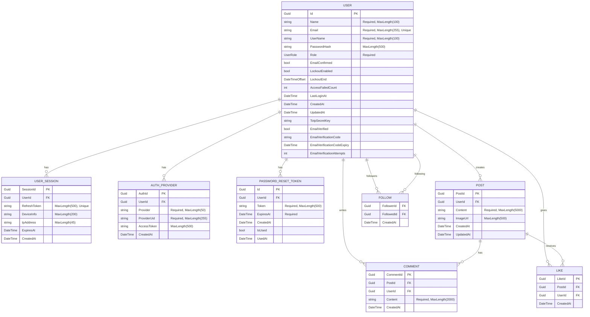

# EchoSpace Entity Relationship Diagram (ERD)

## Mermaid ERD Script



## Relationship Details

### User Relationships
- **User → UserSession**: One-to-Many (User has many sessions)
- **User → AuthProvider**: One-to-Many (User can have multiple OAuth providers)
- **User → PasswordResetToken**: One-to-Many (User can have multiple reset tokens for security)
- **User → Post**: One-to-Many (User creates many posts)
- **User → Comment**: One-to-Many (User writes many comments)
- **User → Like**: One-to-Many (User gives many likes)
- **User → Follow (Followers)**: One-to-Many (User can have many followers)
- **User → Follow (Following)**: One-to-Many (User can follow many users)

### Post Relationships
- **Post → Comment**: One-to-Many (Post has many comments)
- **Post → Like**: One-to-Many (Post receives many likes)

### Follow Relationship
- **Follow**: Many-to-Many self-referential (Users following other users)
  - FollowerId → User (the one who follows)
  - FollowedId → User (the one being followed)

## Security Fields

### Authentication & Security
- `TotpSecretKey`: Encrypted TOTP secret for 2FA
- `EmailVerificationCode`: 6-digit email verification code
- `EmailVerificationCodeExpiry`: Expiry time for verification code (10 minutes)
- `EmailVerificationAttempts`: Track failed verification attempts (max 3)
- `LockoutEnd`: Account lockout until this time
- `AccessFailedCount`: Track failed login attempts

### Session Management
- `RefreshToken`: One-time use tokens for session management
- `DeviceInfo` & `IpAddress`: Track session metadata for security
- `ExpiresAt`: Automatic session expiration

### Password Reset Security
- `IsUsed`: Single-use token enforcement
- `UsedAt`: Track when token was consumed
- `ExpiresAt`: 1-hour expiry for reset tokens

## Indexes (Recommended)

```sql
-- Performance indexes
CREATE UNIQUE INDEX IX_Users_Email ON Users (Email);
CREATE INDEX IX_UserSessions_UserId ON UserSessions (UserId);
CREATE INDEX IX_UserSessions_RefreshToken ON UserSessions (RefreshToken);
CREATE INDEX IX_UserSessions_ExpiresAt ON UserSessions (ExpiresAt);
CREATE INDEX IX_Posts_UserId ON Posts (UserId);
CREATE INDEX IX_Posts_CreatedAt ON Posts (CreatedAt DESC);
CREATE INDEX IX_Comments_PostId ON Comments (PostId);
CREATE INDEX IX_Likes_PostId ON Likes (PostId);
CREATE INDEX IX_Follows_FollowerId ON Follows (FollowerId);
CREATE INDEX IX_Follows_FollowedId ON Follows (FollowedId);

-- Unique constraint for Follow relationship
CREATE UNIQUE INDEX IX_Follows_Unique ON Follows (FollowerId, FollowedId);
```

## Enum Types

### UserRole
```csharp
public enum UserRole
{
    User = 0,
    Moderator = 1,
    Admin = 2
}
```
